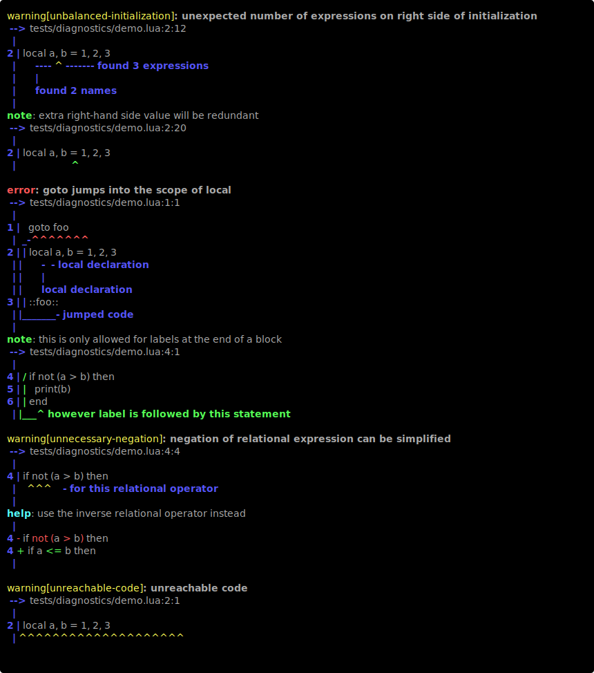

# Yutu
[](https://crates.io/crates/yutu)
[](./LICENSE-MIT)
[](https://crates.io/crates/yutu)
[](https://github.com/0x2a-42/yutu/actions)

[Yutu](https://en.wikipedia.org/wiki/Moon_rabbit) (玉兔) is a linter for Lua (5.4 and 5.5) inspired by [Clippy](https://github.com/rust-lang/rust-clippy).

The list of supported lints can be found [here](./lints.md).

## Example

```lua
goto foo
local a, b = 1, 2, 3
::foo::
if not (a > b) then
  print(b)
end
```


## Quickstart

Install `yutu` using `cargo`.
```sh
cargo install yutu
```

```
Modern Lua linter

Usage: yutu <COMMAND>

Commands:
  check  Checks the code for errors and warnings
  init   Creates a new yutu.toml configuration
  list   Lists all lints as markdown
  help   Print this message or the help of the given subcommand(s)

Options:
  -h, --help  Print help
```

## License
Yutu is licensed under either of

 * Apache License, Version 2.0
   ([LICENSE-APACHE](LICENSE-APACHE) or https://www.apache.org/licenses/LICENSE-2.0)
 * MIT license
   ([LICENSE-MIT](LICENSE-MIT) or https://opensource.org/licenses/MIT)

at your option.

## Contribution

Unless you explicitly state otherwise, any contribution intentionally submitted
for inclusion in the work by you, as defined in the Apache-2.0 license, shall be
dual licensed as above, without any additional terms or conditions.
